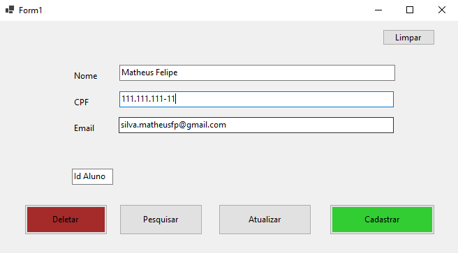
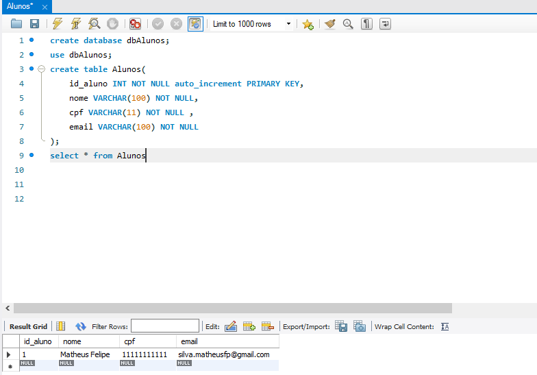
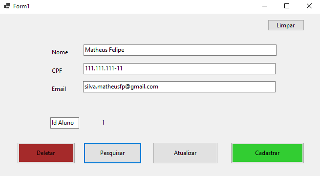
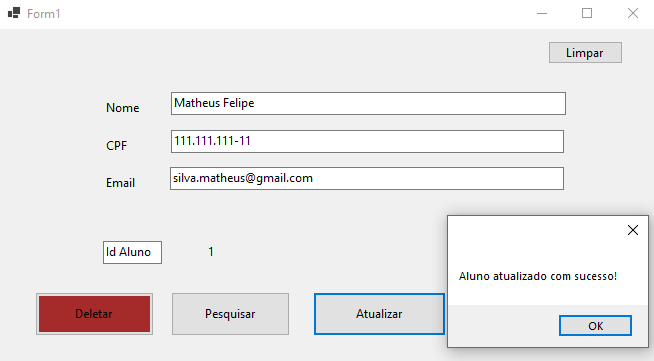
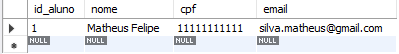

## CRUD C# e MySql com Windows Forms
### Descrição
Este projeto é uma aplicação Windows Forms desenvolvida em C# que implementa um CRUD (Create, Read, Update, Delete) para gerenciar alunos em um banco de dados MySQL. 
O sistema permite o cadastro, consulta, atualização e exclusão de registros de alunos, garantindo uma interface intuitiva para facilitar a manipulação dos dados. Ao consultar Aluno pelo seu CPF, é exibido seu nome, email e Id.
### Tecnologias Utilizadas
• Linguagem: C# 
• Framework: Windows Forms (.NET) 
• Banco de Dados: MySQL 
• Bibliotecas: MySql.Data (para conexão com MySQL) 

  
  
  
  
  
